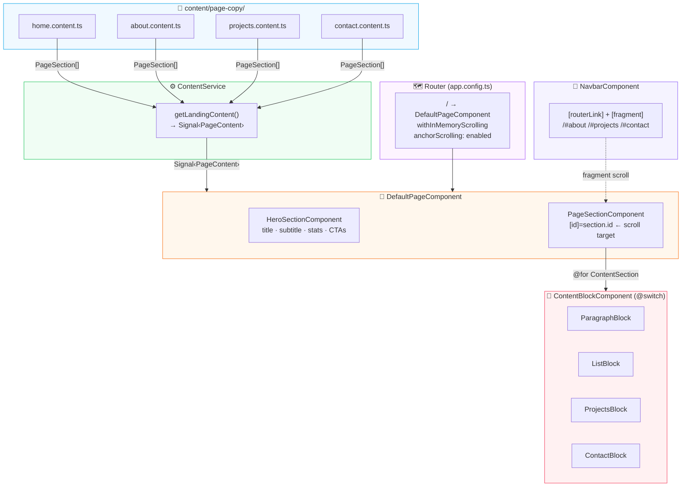

# bryant-devhub

Nx monorepo. Primary project is `personal-site` — my Angular portfolio, deployed to [bryantfranks.com](https://bryantfranks.com).

---

## Workspace Structure

| Project         | Stack                                      | Description                                      |
| --------------- | ------------------------------------------ | ------------------------------------------------ |
| `personal-site` | Angular 20, Tailwind CSS, Angular Material | Personal portfolio — SSG, single-page scroll SPA |

---

## personal-site

### Tech Stack

- Angular 20 — standalone components, signals, `@if/@for` control flow, OnPush throughout
- Nx monorepo — `@angular/build:application`, `outputMode: "server"`, SSG prerender
- Tailwind CSS v3 — custom P3 color palette, `darkMode: 'class'`
- Angular Material — form components and icon system
- TypeScript strict mode — `strictTemplates`, `noImplicitReturns`, `strictInjectionParameters`
- Jest — 55 unit tests across 7 suites

### Architecture

Content is data-driven. A `ContentService` assembles typed `PageContent` objects from static `PageSection[]` constants and returns Angular `Signal<PageContent>` to page components. The service is the sole CMS abstraction seam — swapping to HTTP requires only changing the service, never the components.

Navigation uses Angular Router fragment scrolling (`withInMemoryScrolling`) on a single `/` route. Clicking About/Projects/Contact updates the URL to `/#about`, `/#projects`, `/#contact` and scrolls to the matching `section[id]`. No component destroy/recreate on nav — seamless one-page feel with deep-link support.

```typescript
// content.dto.ts — canonical model
export interface PageContent {
  title: string;
  subtitle?: string;
  description?: string;
  stats?: HeroStat[];
  ctas?: CtaButton[];
  sections: PageSection[];
}

// ContentService — CMS seam
@Injectable({ providedIn: 'root' })
export class ContentService {
  getLandingContent(): Signal<PageContent> { ... }
}

// Discriminated union drives @switch dispatcher in ContentBlockComponent
export type ContentSection =
  | ParagraphSection
  | ListSection
  | ProjectSection
  | ContactSection;
```



### SCSS Structure

```
src/styles/
├── _variables.scss           # Color tokens, spacing, font constants
├── _base.scss                # Global resets, html/body defaults
├── _mixins.scss              # Reusable patterns
├── _typography.scss          # Inter font system, Material overrides
├── _material-overrides.scss  # Angular Material component customizations
└── _components.scss          # Tailwind component utilities
```

### Running the App

```sh
# Development server
pnpm nx serve personal-site

# Production build
pnpm nx build personal-site --configuration=production

# Unit tests
pnpm nx test personal-site

# Lint
pnpm nx lint personal-site

# E2E
pnpm nx e2e personal-site-e2e
```

Or use the npm script aliases:

```sh
npm run start   # serve
npm run build   # production build
npm run test    # test
npm run lint    # lint
```

### Project Graph

```sh
npx nx graph
```

---

## Nx Workspace

This workspace uses [Nx](https://nx.dev) for task orchestration, caching, and code generation.

```sh
# List all projects
npx nx show projects

# Show targets for a project
npx nx show project personal-site

# Generate a new Angular app
npx nx g @nx/angular:app <name>

# Generate a new library
npx nx g @nx/angular:lib <name>

# Run a target across all affected projects
npx nx affected -t build
```

Targets are defined in each project's `project.json` or inferred by Nx plugins.

---

## Status

### Architecture Refactor (in progress — see [ARCHITECTURE_REFACTOR.md](apps/personal-site/ARCHITECTURE_REFACTOR.md))

| Issue | Description                                                                                                        | Status      |
| ----- | ------------------------------------------------------------------------------------------------------------------ | ----------- |
| #5    | `PageContent` model fix — `sections` required, `content[]` removed                                                 | ✅ Done     |
| #8    | `ContentService` CMS seam — signals, zero direct content imports in components                                     | ✅ Done     |
| #2    | God component decomposition — `HeroSectionComponent`, `PageSectionComponent`, `ContentBlockComponent`, leaf blocks | ✅ Done     |
| #9    | Move hardcoded contact data into `ContactBlockComponent` input (same pass as #2)                                   | ✅ Done     |
| #3    | `SafeHtmlPipe` audit — enforce on all `[innerHTML]` bindings (same pass as #2)                                     | ✅ Done     |
| #1    | Fragment routing — `withInMemoryScrolling` + anchor nav on single `/` route                                        | ✅ Done     |
| #10   | 404 `NotFoundComponent` replacing wildcard redirect                                                                | 🔲 Next     |
| #12   | Visual redesign — distinct personal aesthetic, not generic Tailwind template                                       | 🔲 Post-MVP |
| #13   | 80% unit test coverage via SonarCloud                                                                              | 🔲 Post-MVP |
| #14   | CI/CD — GitHub Actions + SonarCloud quality gate                                                                   | 🔲 Post-MVP |
| #15   | Cypress E2E smoke suite                                                                                            | 🔲 Post-MVP |

### General

- [x] Pre-flight fixes — SSR safety, OnPush signals, Tailwind darkMode, animation async
- [x] Content — all sections written with real copy (home, about, projects, contact)
- [x] Unit tests — 55 passing across 7 suites
- [ ] Contact form — Formspree integration (unblocked after #9)
- [ ] Active section highlighting in navbar
- [ ] Dark/light theme toggle
- [ ] SEO meta tags and OG tags
- [ ] Vercel deployment with custom domain
