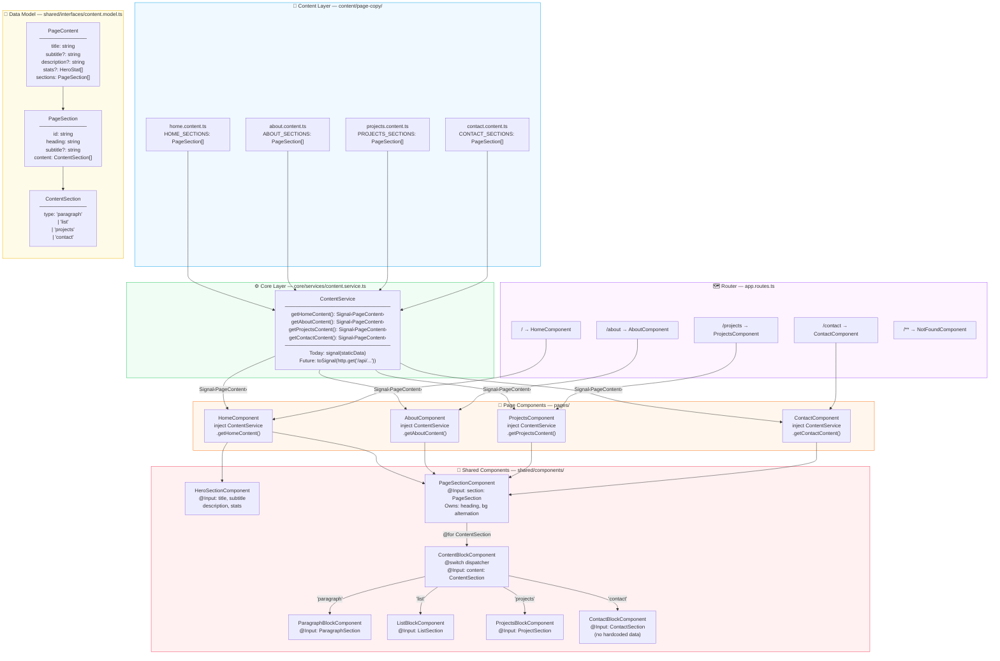

# Personal Site — Architecture Refactor Tracker

Findings from architectural review on **May 12, 2026**.

---

## Architecture Diagram — Proposed Data Flow



---

## Issues — Implementation Order

Ordered by dependency and MVP impact. Each step unblocks the next.

| Order  | Issue | Description                                                                               | Status                    |
| ------ | ----- | ----------------------------------------------------------------------------------------- | ------------------------- |
| **1**  | #5    | Fix `PageContent` model — drop `content[]`, `sections[]` is the contract everywhere       | `[x] Done — May 19, 2026` |
| **2**  | #8    | `ContentService` — insert the CMS seam, components stop importing constants directly      | `[x] Done — May 19, 2026` |
| **3**  | #2    | God component decomposition — `@switch` dispatcher + block components                     | `[ ] Todo`                |
| **4**  | #9    | Move hardcoded contact data into content files (done in same pass as #2)                  | `[ ] Todo`                |
| **5**  | #3    | `SafeHtmlPipe` audit — enforce consistently across all new leaf components                | `[ ] Todo`                |
| **6**  | #1    | Real routing — `/`, `/about`, `/projects`, `/contact` wired to page components            | `[ ] Todo`                |
| **7**  | #10   | 404 route — replace wildcard redirect with `NotFoundComponent`                            | `[ ] Todo`                |
| **8**  | #12   | Visual redesign — replace cookie-cutter Tailwind aesthetic with a distinct personal style | `[ ] Todo`                |
| **9**  | #13   | Unit tests — 80% coverage enforced via SonarCloud quality gate                            | `[ ] Post-MVP`            |
| **10** | #14   | CI/CD pipeline — GitHub Actions + SonarCloud with quality gate on PRs                     | `[ ] Post-MVP`            |
| **11** | #15   | E2E tests — Cypress smoke suite covering routing, SSR hydration, and key UI               | `[ ] Post-MVP`            |
| **12** | #4    | Eager loading review — low value now, revisit if content grows significantly              | `[ ] Post-MVP`            |
| **13** | #6    | Rename `.dto.ts` → `.model.ts`                                                            | `[ ] Post-MVP`            |
| **14** | #7    | `export type` cleanup in barrel `index.ts`                                                | `[ ] Post-MVP`            |

---

---

## Issue #5 — PageContent Model: `sections` Wins

### Decision

**`content?: ContentSection[]` is removed from `PageContent`. `sections: PageSection[]` is the single, required shape.**

The flat `content[]` field was a shortcut from when the app was one scrollable page. It is incompatible with `PageSectionComponent`, which expects a `PageSection`. Keeping both requires every consumer to guess which field to use.

### Interface Changes

```typescript
// BEFORE — content.model.ts
export interface PageContent {
  title: string;
  subtitle?: string;
  description?: string;
  stats?: HeroStat[];
  content?: ContentSection[]; // ← DELETE THIS
  sections?: PageSection[]; // ← make required
}

// AFTER
export interface PageContent {
  title: string;
  subtitle?: string;
  description?: string;
  stats?: HeroStat[];
  sections: PageSection[]; // required, no ambiguity
}
```

### Content File Changes

Individual content files stop exporting a `PageContent` and instead export `PageSection[]`. `ContentService` assembles the full `PageContent`:

```typescript
// home.content.ts — BEFORE
export const HOME_CONTENT: PageContent = {
  title: 'Bryant Franks',
  content: [{ type: 'paragraph', content: '...' }],
};

// home.content.ts — AFTER
export const HOME_SECTIONS: PageSection[] = [
  {
    id: 'home',
    heading: 'Welcome',
    content: [{ type: 'paragraph', content: '...' }],
  },
];
```

### What Happens to `LANDING_CONTENT`

It is deleted entirely. It only existed to flatten all sections into one page for the single-route design. `ContentService` replaces it — each method assembles one page's `PageContent` from its own `PageSection[]` export.

### Acceptance Criteria

- [x] `content?: ContentSection[]` removed from `PageContent` interface
- [x] `sections` is `required` (not optional) on `PageContent`
- [x] All `*.content.ts` files export `PageSection[]`, not `PageContent`
- [x] `LANDING_CONTENT` deleted
- [x] TypeScript compiles with no errors after the change

> **Completed May 19, 2026.** `HeroStat` and `ContactSection` also added to the model in this pass.

---

## Issue #2 — God Component Decomposition Plan

### Current State

`DefaultPageComponent` owns a 254-line template that:

- Renders the entire Hero section inline
- Iterates sections and branches on `content.type` with chained `@if` blocks
- Has a special-case `@if (section.id === 'contact')` bypass that re-loops content
- Contains hardcoded contact info (email, GitHub, location) in the template

### Target Component Tree

```
DefaultPageComponent          ← orchestrator only, ~20 lines of template
├── HeroSectionComponent      ← hero title, subtitle, description, stats, CTAs
└── PageSectionComponent[]    ← one per section (id, heading, subtitle, bg alternation)
    └── ContentBlockComponent ← @switch (content.type) dispatcher
        ├── ParagraphBlockComponent
        ├── ListBlockComponent
        ├── ProjectsBlockComponent
        └── ContactBlockComponent  ← replaces the section.id === 'contact' special case
```

### Decided Approach — `@switch` Dispatcher

The chosen solution is a **`ContentBlockComponent`** that acts as a `@switch` dispatcher over the `ContentSection` discriminated union. This is the confirmed implementation pattern.

**`ContentBlockComponent`** receives the union type and immediately dispatches:

```typescript
// content-block.component.ts
@Component({
  selector: 'app-content-block',
  standalone: true,
  imports: [
    ParagraphBlockComponent,
    ListBlockComponent,
    ProjectsBlockComponent,
    ContactBlockComponent,
  ],
  template: `
    @switch (content().type) { @case ('paragraph') {
    <app-paragraph-block [section]="asParagraph()" /> } @case ('list') {
    <app-list-block [section]="asList()" /> } @case ('projects') {
    <app-projects-block [section]="asProjects()" /> } @case ('contact') {
    <app-contact-block [section]="asContact()" /> } }
  `,
  changeDetection: ChangeDetectionStrategy.OnPush,
})
export class ContentBlockComponent {
  content = input.required<ContentSection>();

  asParagraph() {
    return this.content() as ParagraphSection;
  }
  asList() {
    return this.content() as ListSection;
  }
  asProjects() {
    return this.content() as ProjectSection;
  }
  asContact() {
    return this.content() as ContactSection;
  }
}
```

Each leaf block receives a **narrowed, concrete type** as its input — zero type-checking inside leaf components. The `@switch` already guarantees the type before the cast.

**Why `@switch` over `NgComponentOutlet`:** `NgComponentOutlet` adds a component registry map and injector boilerplate for no gain here. `@switch` is simpler, statically analyzable by the Angular compiler, and tree-shakeable.

**Why not keep `@if` chains:** Adding a new content type requires touching the parent template. With `@switch` in `ContentBlockComponent`, adding a new type means creating one new leaf component and adding one `@case` — the parent `PageSectionComponent` is untouched.

Other structural decisions:

- `PageSectionComponent` owns section scaffold (id, heading, subtitle, background alternation) — not `DefaultPageComponent`.
- `HeroSectionComponent` is fully isolated so it can evolve independently without touching the section rendering path.
- All components **standalone** with `ChangeDetectionStrategy.OnPush`.

### Recommended File Structure

```
src/app/
├── pages/
│   └── default-page/
│       ├── default-page.component.ts       ← keep, slim down
│       └── default-page.component.html     ← reduce to ~20 lines
├── shared/
│   └── components/
│       ├── hero-section/
│       │   ├── hero-section.component.ts
│       │   └── hero-section.component.html
│       ├── page-section/
│       │   ├── page-section.component.ts
│       │   └── page-section.component.html
│       ├── content-block/
│       │   ├── content-block.component.ts   ← @switch dispatcher
│       │   ├── paragraph-block/
│       │   ├── list-block/
│       │   ├── projects-block/
│       │   └── contact-block/
```

### Acceptance Criteria

- [ ] `default-page.component.html` is ≤ 25 lines
- [ ] No `@if (content.type === ...)` chains remain in any parent template
- [ ] Each block component receives a typed input matching its interface (not `ContentSection`)
- [ ] All new components use `OnPush` and are standalone
- [ ] `SafeHtmlPipe` is applied consistently wherever `[innerHTML]` is used

---

## Issue #8 — ContentService: CMS Migration Seam

### Goal

No actual CMS migration is planned. The goal is to insert a single abstraction layer so that when/if a CMS is added, **components never change** — only the service implementation swaps out.

### Decided Approach — `ContentService` with Signal-based API

Introduce a `ContentService` that components consume. It currently returns static constants wrapped in Angular signals. When a CMS is introduced, only this service changes.

```typescript
// src/app/core/services/content.service.ts
@Injectable({ providedIn: 'root' })
export class ContentService {
  private http = inject(HttpClient); // ready for future use, unused now

  // Each method returns a Signal<PageContent>
  // Today: wraps a static constant. Tomorrow: wraps an HTTP call via toSignal().
  getHomeContent(): Signal<PageContent> {
    return signal({
      title: 'Bryant Franks',
      subtitle: 'Angular Engineer & Full-Stack Developer.',
      sections: HOME_SECTIONS,
    });
  }

  getAboutContent(): Signal<PageContent> {
    return signal({ title: 'About', sections: ABOUT_SECTIONS });
  }

  getProjectsContent(): Signal<PageContent> {
    return signal({ title: 'Projects', sections: PROJECTS_SECTIONS });
  }

  getContactContent(): Signal<PageContent> {
    return signal({ title: 'Contact', sections: CONTACT_SECTIONS });
  }
}
```

Components inject `ContentService` instead of importing content constants directly:

```typescript
// default-page.component.ts (or any page component)
export class DefaultPageComponent {
  private contentService = inject(ContentService);
  pageContent = this.contentService.getLandingContent();
}
```

### Why Signal-based (not Observable)

- Components already use `toSignal` — keeping the surface uniform avoids mixing Signal/Observable subscriptions in templates.
- When migrating to HTTP later: `toSignal(this.http.get<PageContent>('/api/content/landing'))` inside the service is a one-line swap per method. The component is completely untouched.

### What Changes at Migration Time

When a CMS is added, only `ContentService` changes:

| Today                                                      | After CMS migration                                                                                                             |
| ---------------------------------------------------------- | ------------------------------------------------------------------------------------------------------------------------------- |
| `return signal({ title: '...', sections: HOME_SECTIONS })` | `return toSignal(this.http.get<PageContent>('/api/content/home'), { initialValue: { title: '...', sections: HOME_SECTIONS } })` |

The `initialValue` ensures no flicker — static content pre-populates until the CMS response arrives.

### File Location

```
src/app/core/
└── services/
    └── content.service.ts
```

`core/` is the correct Angular convention for singleton services that are app-wide and not tied to a single feature.

### Acceptance Criteria

- [x] `ContentService` created under `src/app/core/services/`
- [x] All page components inject `ContentService` — zero direct imports of content constants in components
- [x] Content constants remain in `content/page-copy/` as the static data source (they are still used, just only by the service)
- [x] `HttpClient` imported in the service even if unused — documents the intended extension point
- [x] Return type is `Signal<PageContent>` on all methods

> **Completed May 19, 2026.** `provideHttpClient(withFetch())` added to `app.config.ts`. `getLandingContent()` added as a temporary combined-page method — to be removed when Issue #1 (routing) lands. 29 unit tests added for `ContentService`.

---

## Issue #9 — Hardcoded Data in Template

Move all personal contact data out of the template into `contact.content.ts` (or a dedicated `site-config.ts` constant):

- `bryant.franks@gmail.com`
- `https://github.com/Bfranks56`
- `Royal Oak, MI`

`ContactBlockComponent` (from Issue #2) should receive this from its input, not from hardcoded markup.

---

## Issue #10 — 404 Route

Add a `not-found` page component and wire it to the wildcard route instead of redirecting:

```typescript
{ path: '**', loadComponent: () => import('./pages/not-found/not-found.component').then(c => c.NotFoundComponent) }
```

Update `app.routes.server.ts` to prerender the 404 path.

---

## Issue #1 — Routing Plan

> To be detailed after god component and ContentService work is complete.

- Add routes: `/`, `/about`, `/projects`, `/contact`
- Wire existing `about/`, `contact/` page component folders to real routes
- Each route's component injects `ContentService` and calls the appropriate method
- Remove `data: { pageContent: ... }` route data pattern — components own their content fetch via the service
- Update `app.routes.server.ts` prerender paths to include all routes

---

## Issue #3 — innerHTML / SafeHtmlPipe Audit

> To be resolved during decomposition — easier to audit and enforce per leaf component.

Locations currently using raw `[innerHTML]` without pipe:

- Hero `h1` title
- Hero `h2` subtitle
- Hero `p` description
- `content.heading` in paragraph blocks
- `item` in list blocks

---

## Issue #12 — Visual Redesign

### Why Pre-MVP

The architecture refactor makes the code defensible. The visual is the first impression — a recruiter or hiring engineer decides in seconds whether to keep reading. The current design is indistinguishable from a generic Tailwind portfolio template. That works against the goal of the site.

Scheduled **after** the architecture refactor because:

- The decomposed component tree makes restyling surgical — each block component is isolated
- Redesigning the god component template first means doing the work twice
- Routing must exist before per-page layout decisions make sense

### Scope

**What changes:**

- Typography system — typeface choices, scale, weight contrast
- Color palette — move away from default blue/gray Tailwind
- Layout language — spacing rhythm, grid decisions, section transitions
- Hero section — most visible, highest impact
- Component-level treatments per block type (projects cards, skill lists, contact section)

**What does not change:**

- Content (copy, projects, skills)
- Data model or component architecture
- SSR / prerender behavior

### Constraints

- Must stay Tailwind-based — no CSS framework swap
- Must remain fully responsive
- SSR-safe — no runtime-only layout tricks

### Acceptance Criteria

- [ ] Design direction decided (reference sites, mood board, or written aesthetic brief)
- [ ] Typography and color tokens defined as Tailwind config extensions
- [ ] Hero section redesigned
- [ ] All block components restyled consistently
- [ ] Visually distinct from default Tailwind portfolio aesthetic
- [ ] Passes Lighthouse accessibility score ≥ 90

---

## Issue #13 — Unit Tests (80% Coverage)

### Goal

Demonstrate professional testing habits. Not exhaustive coverage for its own sake — targeted tests on the components and services where behavior matters.

### Priority Targets

| Target                  | What to test                                                       |
| ----------------------- | ------------------------------------------------------------------ |
| `ContentService`        | Each method returns a `Signal<PageContent>` with the correct shape |
| `ContentBlockComponent` | Correct child component rendered for each `ContentSection` type    |
| `PageSectionComponent`  | Correct heading, subtitle, and background class rendered           |
| `HeroSectionComponent`  | Title, subtitle, stats render correctly from inputs                |
| Leaf block components   | Smoke test — renders without error given valid input               |

### Coverage Gate

80% line coverage enforced by SonarCloud. Pipeline blocks merge if it drops below threshold.

### Acceptance Criteria

- [ ] All priority targets have meaningful tests (not just scaffolding)
- [ ] `ng test --code-coverage` produces an lcov report
- [ ] Coverage is ≥ 80% lines

---

## Issue #14 — CI/CD Pipeline

### Toolchain

| Tool           | Purpose                                         | Cost               |
| -------------- | ----------------------------------------------- | ------------------ |
| GitHub Actions | Run pipeline on push/PR                         | Free (public repo) |
| SonarCloud     | Static analysis + coverage gate + PR decoration | Free (public repo) |
| Nx `affected`  | Only lint/test/build what changed               | Free               |

### Pipeline Order

```
Push / PR
└── GitHub Actions
    ├── nx affected --target=lint
    ├── nx affected --target=test --coverage
    │   └── lcov report → SonarCloud scan
    │       └── quality gate: coverage ≥ 80%, no new blocker issues
    ├── nx affected --target=build
    └── nx affected --target=e2e  ← runs against built output
```

### Acceptance Criteria

- [ ] `.github/workflows/ci.yml` created
- [ ] SonarCloud project connected to repo
- [ ] Quality gate blocks PR merge on coverage failure or blocker issues
- [ ] SonarCloud posts inline annotations on PRs
- [ ] Pipeline passes clean on `main`

---

## Issue #15 — E2E Tests (Cypress)

### Scope

Narrow smoke suite. Goal is to demonstrate the habit, not achieve exhaustive coverage. Cypress is already wired up in `personal-site-e2e` — infrastructure cost is zero.

### Test Cases

| Test                                                 | What it proves                                |
| ---------------------------------------------------- | --------------------------------------------- |
| `/` loads, hero title visible                        | SSR hydration works, home route healthy       |
| `/about` loads without error                         | Routing works                                 |
| `/projects` loads, at least one project card visible | Projects data flows through                   |
| `/contact` loads, contact links present              | Contact route healthy                         |
| Bad URL (`/doesnotexist`) shows 404 page             | Wildcard route works                          |
| Nav links route to correct pages                     | Router integration                            |
| Contact email `href` is correct                      | Hardcoded data was moved to content correctly |

### Acceptance Criteria

- [ ] All 7 test cases implemented in `apps/personal-site-e2e/src/e2e/`
- [ ] Tests run against built SSR output, not dev server
- [ ] All tests pass in CI pipeline
- [ ] Suite completes in under 60 seconds
